在点云操作中，常常需要从大量点云中找到距离输入点最近的点，如果使用线性搜索，逐个判断与输入点的距离，那么搜寻耗时将会与点云规模呈线性上升趋势，时间复杂度为$O(N)$。显然这不是我们想看到的，在数据结构与算法中，对**一维数据**常用的搜索方法是**二分查找**，时间复杂度为$O(logN)$，它本质上是构建一棵二叉搜索树，以空间换取时间。而**KD-Tree**(K-Dimension Tree)，也就做K维树，则可以看做是**二叉树在K维空间的扩展**，它的搜索效率也能近似达到$O(logN)$。

# 二叉搜索树

首先看一下二叉搜索树。假设有如下的7个一维数据：
$$
X=\{3\ 6\ 5\ 2\ 4\ 1\ 7\}
$$
使用递归的方式构建二叉树，python伪代码如下：

```python
class Node:
    def __init__(self, value, left, right):
        self.value = value
        self.left  = left
        self.right = right
def make_tree(data):
    if len(data) == 0:
        return None
    sort(data) 			# 按照升序排列
    mid = len(data) / 2 # 取出中点
    node = Node(data[mid], 
      			make_tree(data[0 : mid - 1]),  			# 左子树
                make_tree(data[mid + 1 : len(data)])) 	# 右子树
    return node
```

使用该方式构建的二叉树如下：

```mermaid
graph TB
A((1))
B((2))
C((3))
D((4))
E((5))
F((6))
G((7))
D-->B-->A
B-->C
D-->F-->E
F-->G
```

二叉树的特点就是每一个节点**左子树上所有节点都小于该节点**，而**右子树的所有节点都大于该节点**。

如果**用线性搜索从中找到距离输入数据最近的节点，那么要进行7次比较**。但是用二叉树搜索的话，比较次数会大大减少。如果要搜索距离$y=2.1$最近的点，只需要**先和$x=4$比较**，由于$2.1<4$，进入左子树，此时最短距离为$d=4-2.1=1.9$；**继续和$x=2$比较**，由于$2.1>2$，进入右子树，此时最短距离$d=2.1-2=0.1$；**最后和$x=3$比较**，它与该节点的距离为$3-2.1=0.9$，大于上次比较的最短距离，所以距离$y=2.1$最近的节点为$x=2$。**使用二叉树只需要比较3次就能找到最近节点**，搜索的时间复杂度为$O(logN)$。

但是二叉搜索树仅仅是针对一维数据的搜索方法，没办法照搬到多维数据上，如果要应用到多维数据，就要进行一些改动，KD-Tree就可以看成将二叉树扩维到多维空间上的搜索树。

# KD-Tree

KD-Tree被认为是二叉树在K维空间的扩展，其构建和搜索流程与二叉树基本一致，但都针对多维空间进行了相应的调整。

## 构建KD-Tree

对于一般的二叉树，它的节点只有一维特征，构建二叉树时只需要根据一维数据进行划分即可。对于多维数据，不能只根据某一维特征对整个数据集进行划分。**KD-Tree的划分策略是交替地使用每一维特征进行划分。**

假设有如下由七个二维数据组成的二维数据集：
$$
X=\{(3,7),(2,6),(0,5),(1,8),(7,5),(5,4),(6,7)\}
$$
使用和二叉树相似的递归方法构建KD-Tree，python伪代码如下：

```python
class Node:
    def __init__(self, value, left, right, split):
        self.value = value
        self.left  = left
        self.right = right
        self.split = split # 划分的维度
def make_tree(data):
    if len(data) == 0:
        return None
    sort(data, split) 			# 对指定维度按照升序排列
    mid = len(data) / 2 # 取出中点
    node = Node(data[mid], 
      			make_tree(data[0 : mid - 1]),  			# 左子树
                make_tree(data[mid + 1 : len(data)])) 	# 右子树
    			(split + 1) % dim # 交替使用各个维度进行划分
    return node
```

首先按照第1维特征进行划分(split)，过程与二叉树构建方法一致，划分完成后，第1维数据比根节点第1维数据大的节点被划分到根节点的右子树上，比根节点小的节点被划分到左子树上；继续进行递归，在左右子树分别按照第2维数据进行划分。

最后得到的二维KD-Tree如下，可以观察到每一个节点左子树上的节点**在指定维度上**的值都比该节点在相应维度上的值小，右子树则都要大。

```mermaid
graph TB
1802((3,7))
1802-->1540
1540((2,6))
1540-->1280
1280((0,5))
1540-->2049
2049((1,8))
1802-->1290
1290((7,5))
1290-->1029
1029((5,4))
1290-->1799
1799((6,7))
```

当然这样不够直观，可以将该二维数据画在一个平面上：

| 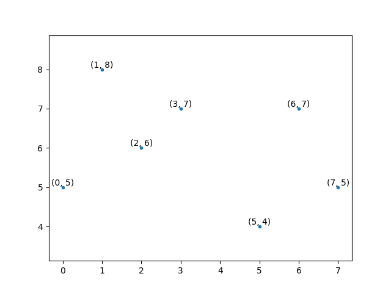 | 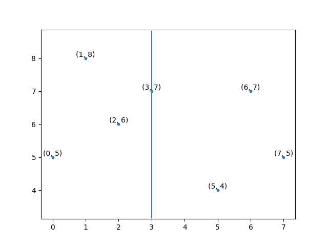 |
| :----------------------------------------------------------: | :----------------------------------------------------------: |
|                         原始数据分布                         | 第一次划分：按照第1维特征(x轴特征)进行划分，选取$(3,7)$为根节点将整个点集划分为左右两部分(蓝色线为分界线) |
| 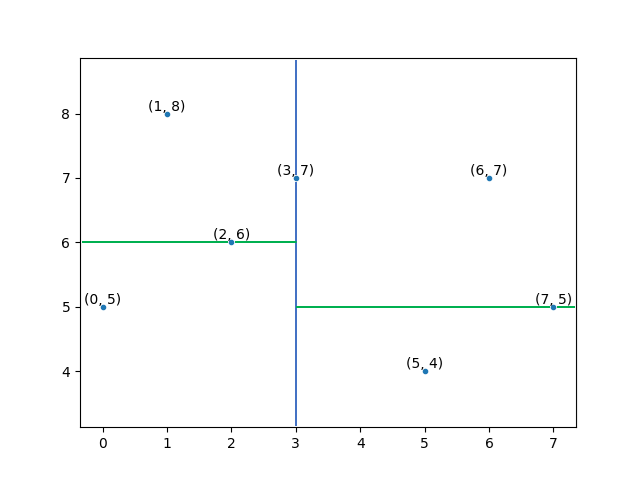 | 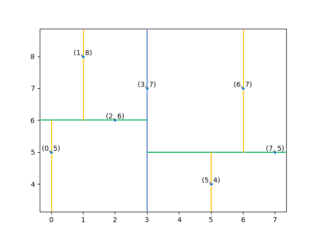 |
| 第二次划分：按照第2维特征(y轴特征)进行划分，分别以$(2,6)$和$(2,6)$为根节点将左右两平面划分为上下两个平面(绿色线为分界线) |          最终的KD-Tree结构，黄色线上的点是叶子节点           |

## 最近邻搜索

构建好KD-Tree后，要如何**搜索给定点的最近邻**呢？KD-Tree是通过一种**二分搜索-回溯**的方式来搜索最近邻的。首先使用类似于**二分搜索**的方式从根节点开始向下搜索，直到找到叶子节点，期间**将访问过的节点都加入到一个栈(Stack)中**，同时记录最短距离；找到叶子节点后开始**回溯**，依次从栈中弹出之前的访问过的节点，判断以待查询点为球心，当前最短距离为半径的**超球面**，与分割面是否有相交，如果相交则进入该节点的另一个分支，继续执行二分搜索，直到搜索到叶子节点，以此循环往复，直到超球面与分割面没有相交。

继续上面的二维KD-Tree例子。假设待查询点为$(5,5.5)$，

| 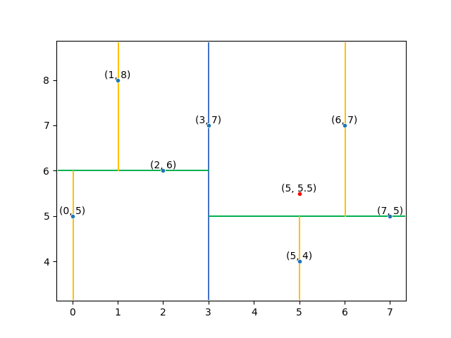 |  |
| :----------------------------------------------------------: | :----------------------------------------------------------: |
|                         原始数据分布                         | 二分查找，与根节点的第1维特征进行比较，由于$5>3$，因此进入右子树(红色部分)。计算与根节点的距离$dist=2.5$，作为当前最短距离 |
| 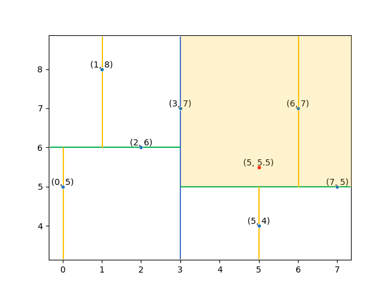 | 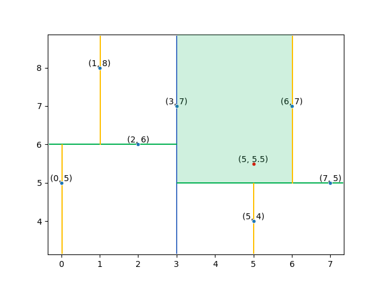 |
| 二分查找，与右半平面分割线上节点的第2维特征进行比较，由于$5.5>5$，因此进入该节点的右子树(橙色部分)。计算与$(7,5)$的距离$dist≈2.0616$，小于当前最短距离，因此更新当前最短距离 | 二分查找，计算与叶子节点$(6,7)$的距离$dist≈1.8028$，小于当前最短距离，因此更新当前最短距离。由于搜索到了叶子节点，接下来开始**回溯** |
| 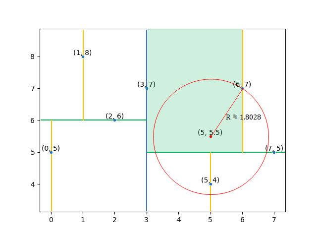 | 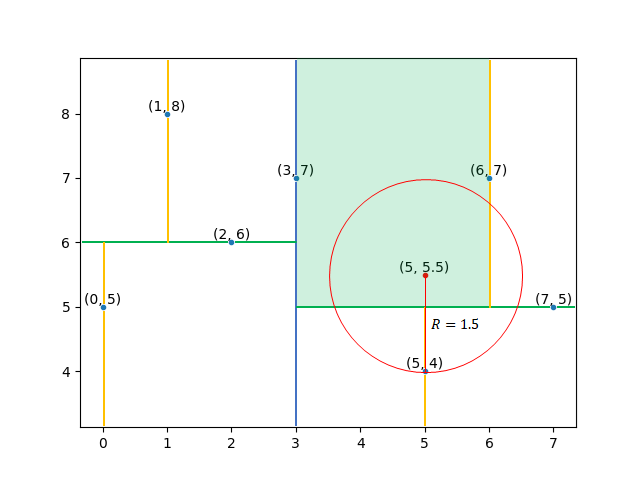 |
| 以待查询点为圆心，当前最短距离为半径作圆，**与$(7,5)$所在的分割线相交**，因此对节点$(7,5)$的另一子树进行搜索。 | 计算与叶子节点$(5,4)$在距离$dist=1.5$，小于当前最短距离，因此更新当前最短距离，继续进行回溯。**由于以待查询点为圆心，当前最短距离为半径的圆与其他分割线无交点，因此认为节点$(5,4)$即为待查询点的最近邻**，最短距离为$1.5$，搜索完毕 |

通过**二分搜索-回溯**机制，可以达到近似于二叉树搜索的效率。Python伪代码如下：

```python
def get_nearest(point): # point: 待查询点
    nearest = root # 首先假定根节点为最近邻
    nearest_dist = get_dist(point, nearest.value) # 获取当前最近距离
    next = root		# 从根节点开始进行二分搜索
    near_nodes = [] # 用来保存访问过的节点
    serach_to_leaf(next, near_nodes) # 以二分搜索的方式搜索到叶子节点
    
    # 回溯
    while len(near_nodes) != 0:
        next = near_nodes[len(near_nodes) - 1]
        near_nodes.pop(len(near_nodes) - 1) # 从栈顶弹出一个节点
        # 判断以查询点为球心的超球面与分割面是否相交
        if abs(point[next.split] - next.value[next.split] < nearest_dist):
            # 相交则需要进入另一分支
            if point[next.split] <= next.value[next.split]:
                next = next.right
            else:
                next = next.left            
            # 对另一子树进行搜寻，直到找到叶子节点
            serach_to_leaf(next, near_nodes)
    
    return nearest.value # 搜索完毕，返回最近邻
```

### 测试

正确性测试：

```
1000000 points' building time is: 1.37681s
input         : 0.191662 0.487925 0.026111
----------- kdtree search -----------
The run time is: 5e-06 s
nearest: 0.187841 0.492951 0.0193923
----------- linear search -----------
The run time is: 0.032365 s
nearest: 0.187841 0.492951 0.0193923
```

耗时测试：

| 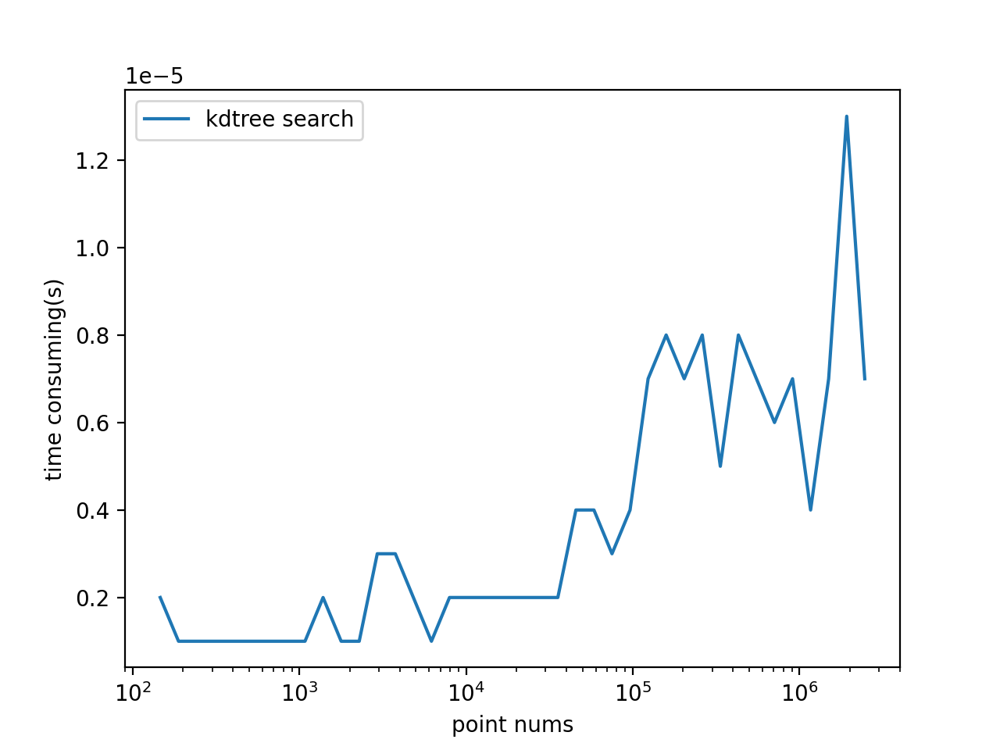 | 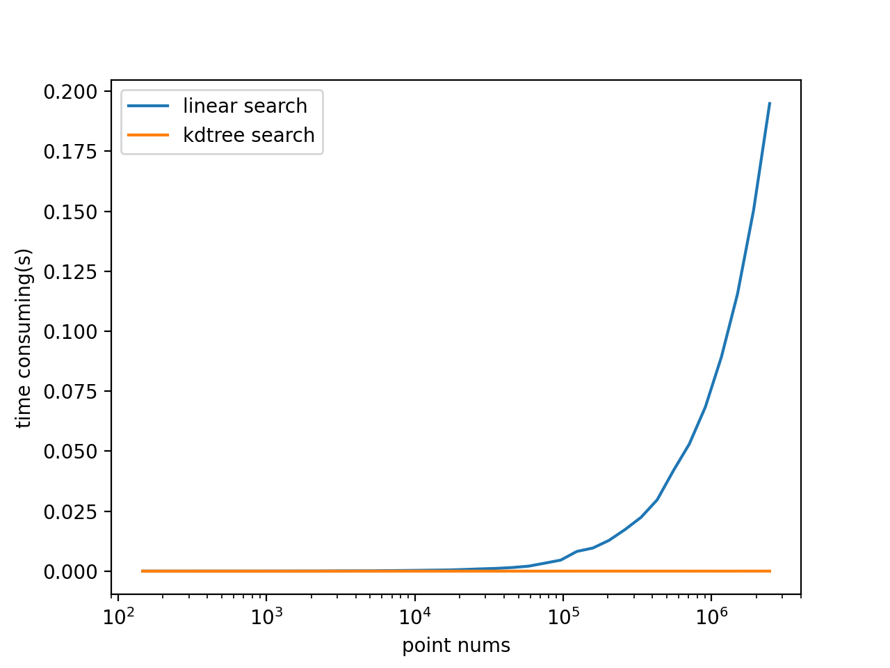 |
| :----------------------------------------------------------: | :----------------------------------------------------------: |
|             KD-Tree搜索耗时随数据规模的变化曲线              |       KD-Tree与线性搜索的处理耗时随数据规模的变化曲线        |

## 插入新节点

使用前述方法构建的KD-Tree实质上是一棵平衡树，这种平衡结构能使搜索效率提高至$O(logN)$。但是当数据集发送变化时，比如增加新节点或者删除节点时，很容易破坏这种平衡结构。想要保持平衡性，就需要重新调用一次构建函数，从头构建整个树结构，这虽然能保证平衡性，但是**相当耗时**。显然这是不可接受的，我们可以借鉴**替罪羊树**的思想来动态插入新节点，在快速插入新节点的同时**保证一定的树结构平衡度**，从而兼顾搜索效率和插入效率。

替罪羊树是一种自平衡树，但它不是严格意义上的平衡树，而是允许一定的**失衡**，失衡的程度用一个常数$\alpha$表示，一般选择$\alpha=0.7$。当$max\{size(left),size(right)\}>\alpha \cdot size(this)$时，**重建整个子树**，被重建的子树的根节点就是“替罪羊”节点。虽然重构的代价较大，但是并不是每次插入新节点都会引发重构操作，所以使用这样一种**代价较大但是次数较少**的重构方式，平摊后插入新节点的时间复杂度为$O(logN)$。

在KD-Tree中，插入新节点也可以通过递归的方式完成，不过需要在每次插入新节点后判断子树有没有失衡，再进行重构操作。Python伪代码如下：

```python
def insert(p): # p: 待插入点
    if root == None:
        root = Node(p, None, None, 0)
    else:
        insert(root, p)

def insert(node, p):
    node.count += 1
    split = node.split
    if p[split] <= node.value[split]:
        if node.left == None:
            node.left = Node(p, None, None, (split + 1) % dim)
        else:
            insert(node.left, p)
        if node.left.count > alpha * node.count:
            rebuild(node)
    else:
        if node.right == None:
            node.right = Node(p, None, None, (split + 1) % dim)
        else:
            insert(node.right, p)
        if node.right.count > alpha * node.count:
            rebuild(node)

def rebuild(node):
    points = []
    pre_order_traversal(node, points) # 先根遍历，把子树上的节点全找出来
    node = make_tree(points)
    
def pre_order_traversal(node, points):
    if node == None:
        return
    points.append(node.value)
    pre_order_traversal(node.left, points)
    pre_order_traversal(node.right, points)
```

以上就实现了KD-Tree的构建、搜索、增加节点操作，完整C++程序见：

[https://gitee.com/ghowoght/kd-tree/blob/master/include/kdtree.hpp](https://gitee.com/ghowoght/kd-tree/blob/master/include/kdtree.hpp)
